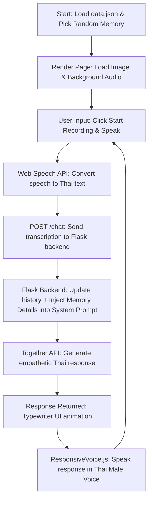

# Remina

**🏆 Awarded Best Research: 2B-KMUTT 20 Future Leader Camp**


Remina is an AI-powered voice chatbot designed to conduct **Reminiscence Therapy** for elderly patients suffering from dementia or Alzheimer's. The project leverages Large Language Models (LLMs) and personalized multimedia cues (photos and ambient audio) to stimulate memory recall, support cognitive engagement, and offer empathetic, warm companionship.

This project was built during the **KMUTT 2B Camp** (2B-KMUTT) under the topic of **LLMs and Elderly Care**.

## Concept & Background

**Reminiscence Therapy** is a non-pharmacological treatment for dementia and Alzheimer's that encourages patients to discuss past events and life experiences, using tangible triggers such as familiar photographs, sounds, or music to stimulate brain activity.

During the KMUTT 2B Camp, this project was developed to explore the intersection of generative AI and dementia care. Remina is designed to act as a patient and caring virtual **"grandchild"**. It features a voice-first interface, which is critical for senior users who may find typing difficult, allowing them to interact naturally through spoken language.

## Features


- **Voice-First Interface**: Integrates the native browser **Web Speech API** for high-accuracy Speech-to-Text (STT) transcription, making the app highly accessible for seniors.
- **Natural Thai Language Interaction**: Employs Typhoon (`scb10x-llama3-1-typhoon2-70b-instruct`) to deliver smooth, respectful, and culturally natural Thai conversational responses.
- **Voice Output (TTS)**: Reads replies aloud using **ResponsiveVoice.js** using a warm Thai male voice.
- **Context-Aware Prompts (Simplified RAG)**: Dynamic system prompts inject specific memory details (location, people, date, event) from local storage to ground the AI in reality and prevent hallucinations.
- **Interactive Memory Cards**: Prominently displays personal images and plays nostalgic ambient/audio files to engage the patient's senses.


- Simply add a memory for the AI to use as context for the chats

## Tech Stack

- **Frontend**: HTML5, Vanilla CSS, Vanilla JavaScript
  - **Speech-to-Text (STT)**: Web Speech API (Browser Native)
  - **Text-to-Speech (TTS)**: ResponsiveVoice.js
- **Backend**: Python (Flask)

## Conversation & Therapy Pipeline



## Try It Out

Experience Remina live in your browser: **[remina-chi.vercel.app](https://remina-chi.vercel.app/)**

## Environment Variables Configuration

To run the project, create a `.env` file in the `app_project` directory with the following variables:

```ini
TOGETHER_API_KEY=your_together_api_key
FLASK_SECRET_KEY=your_flask_session_secret
```

---

## Local Setup & Execution

You can run Remina locally either using a Python virtual environment or Docker.

### Option 1: Running with Python (Local Virtual Environment)

1. **Clone the repository:**
   ```bash
   git clone https://github.com/DeclineZ/2B-Reminaa.git
   cd 2B-Reminaa/app_project
   ```

2. **Create and activate a virtual environment:**
   ```bash
   # Create virtual environment
   python -m venv venv

   # Activate it (Linux/macOS)
   source venv/bin/activate

   # Activate it (Windows)
   venv\Scripts\activate
   ```

3. **Install the dependencies:**
   ```bash
   pip install -r requirements.txt
   ```

4. **Configure Environment Variables:**
   - Copy `.env.example` to `.env` and fill in your API credentials:
     ```bash
     cp .env.example .env
     ```

5. **Run the Flask application:**
   ```bash
   python app.py
   ```
   Open your browser and navigate to `http://127.0.0.1:5000`.

---

### Option 2: Running with Docker & Docker Compose

If you have Docker and Docker Compose installed:

1. **Clone the repository:**
   ```bash
   git clone https://github.com/DeclineZ/2B-Reminaa.git
   cd 2B-Reminaa/app_project
   ```

2. **Configure Environment Variables:**
   - Copy `.env.example` to `.env` and fill in your API credentials:
     ```bash
     cp .env.example .env
     ```

3. **Build and run the container:**
   ```bash
   docker-compose up --build
   ```
   Open your browser and navigate to `http://127.0.0.1:5000`.
